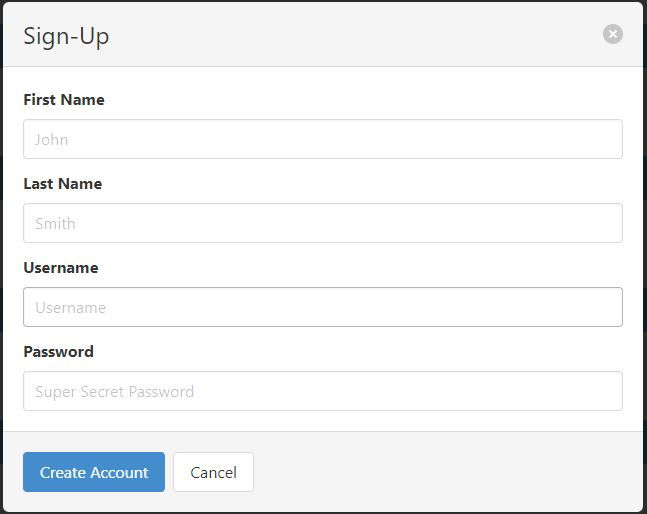
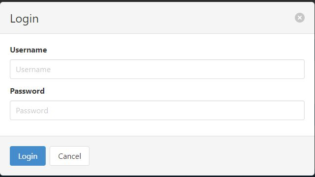
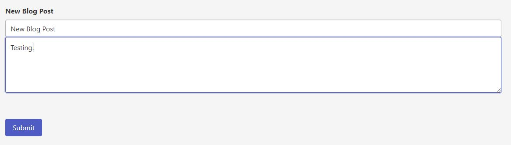
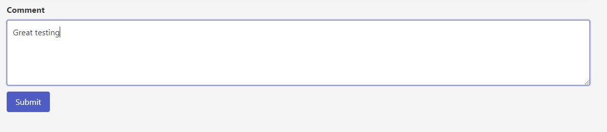
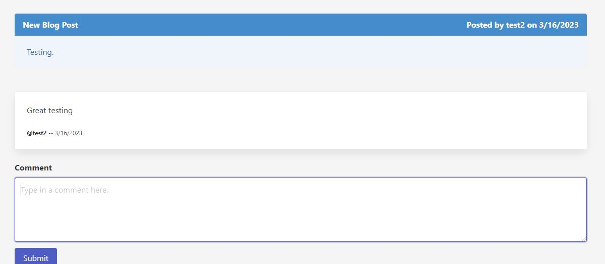

# Tech Blog

## Description
Blog to write down your tech thoughts and share with others.

## Table of Contents
 - [Tech Blog](#tech-blog)
 - [Description](#description)
 - [Installation Instructions](#installation-instructions)
 - [Usage Information](#usage-information)
 - [License](#license)
 - [Contribution Guidelines](#contribution-guidelines)
 - [Testing Instructions](#testing-instructions)
 - [Questions?](#questions)

## Installation Instructions
Go to https://github.com/lunchtimewhee/Tech-Blog.
https://stormy-lake-23898.herokuapp.com/

## Questions?
- Github: https://github.com/lunchtimewhee 
- Email: anthonyrli1994@gmail.com

## Usage Information

1. Signup/Login

2. Add new posts

3. Comment on posts

4. View blog posts

## License

## Contribution Guidelines
Please reach out to Anthony Li at the contacts listed.

## Testing Instructions
N/A

